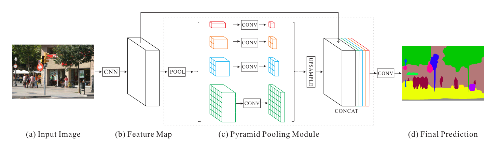
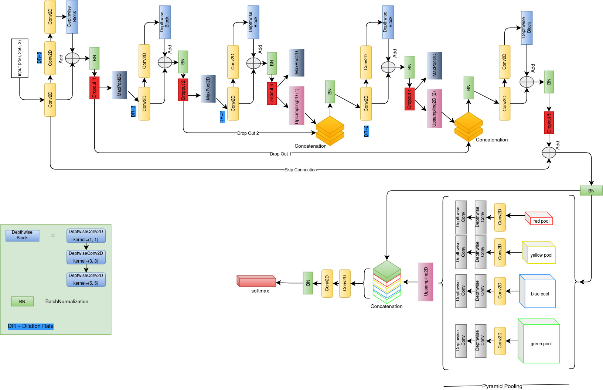

# A segmentation model based on PSPNet trained on CamVid data

<h1 align='center'><strong>Camvid Semantic Segmentation</strong></h1>

# Data

The data used in this work is the Cambride-Driving Labeled Video Database, short for CamVid. Which can be found [here](https://www.kaggle.com/datasets/carlolepelaars/camvid). 

**N.B. The owner of this Dataset is The University of Cambridge.**

The Cambridge-driving Labeled Video Database (CamVid) provides ground truth labels that associate each pixel with one of 32 semantic classes. This dataset is often used in (real-time) semantic segmentation research.

The original dataset can be found [here](http://mi.eng.cam.ac.uk/research/projects/VideoRec/CamVid)

# Data Preparation

The data was already prepared and useable from the get go, as it was already in kaggle, so no data collection and preparation was necessary. But to work with the images and train a model, some basic preparation was necessary. Including:

* Loading the data at much smaller size (256, 256, 3) as it would cause memory issue. The original images were of size (720, 960, 3)
* Getting the RGB mapping of the classes from the provided dictionary.
* Creating mapping to get the RGB values by the class index.
* Adjusting the semantic maps for all the 32 classes.

# Model Training

## Model Architecture

There are different model architectures to approach segmentation problems, whcih differes from the typical classfication problems. As segmentation works with the localization of the object in the image. Different approaches was necessary. The Unet, FCN (Fully Convolutional Network), PSPnet are some of the architectures that are commonly used when solving segmentation problems. 

In this work, I've utilized the Pyramid Scene Parsing Network [PSPNet](#1) architecture for the segmentation task. The PSPNet utilizes pyramid parsing module to harvest different sub-region representations, followed by upsampling and concatenation layers to form the final feature representation. which carries both local and global context information. Finally, the representation is fed into a convolution layer to get the final per-pixel prediction. [[1]](#1)

 

Image source: [PSPNet paper](#1)

In the paper, they've used a pretrained ResNet[[2]](#2) model with the dilated network strategy to extract the feature map. But in this work, I've implemented my own network to extract the feature maps. I've achieved **0.79** DICE score and **0.76** IOU score with only 3.3M parameters.

The network which was used in this work, is given below:

 

## Technical Details

* Tensorflow Machine learning library was used
* Total model parameters 3.3M+
* Model was trained for 50 epochs
* Loss function: `Categorical Cross Entropy`
* Metrics used: `DICE`, `IOU`, `ACCURACY`

## Result

`DICE score` : 0.79

`IOU score` : 0.76 

# References

<a id="1">[1]</a> H.Zhao, J. Shi, X. Qi, X. Wang, J. Jia Pyramid Scene Parsing Network. https://arxiv.org/abs/1612.01105  

<a id="2">[2]</a> K. He, X. Zhang, S. Ren, and J. Sun. Deep residual learning for image recognition. https://arxiv.org/abs/1512.03385